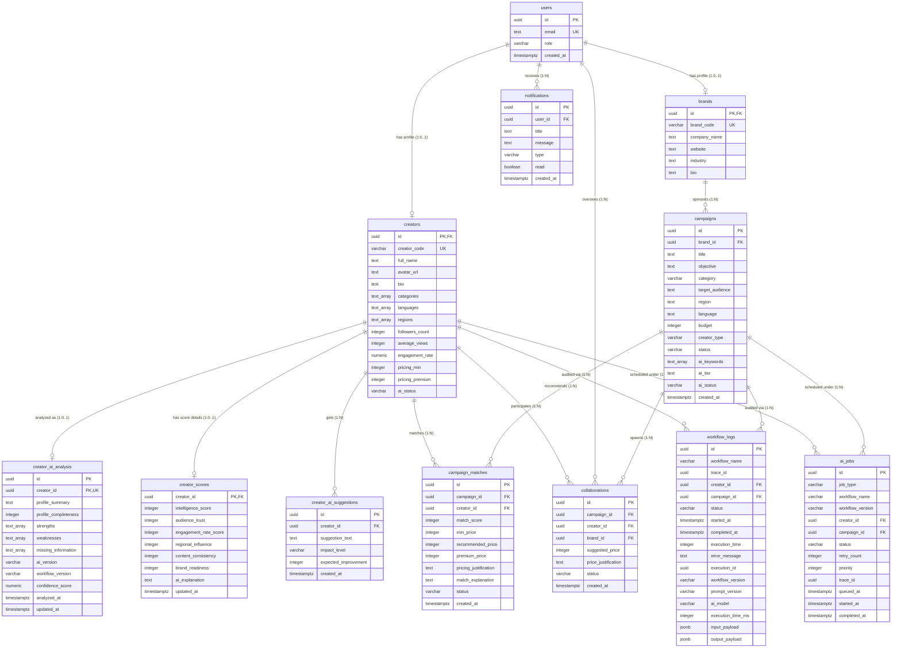

# CreatorLens Database ERD

This document contains the Entity Relationship Diagram (ERD) and description of the relational database schema deployed in Supabase.

## Entity Relationship Diagram

## Key Relationships Breakdown

1. **User Identity Profile mapping:**
   - A single row in `users` maps 1-to-1 with either `creators` or `brands` based on the user's portal role. Their foreign key `id` references `users(id)`.
2. **Creator AI Intelligence separation:**
   - `creators` connects 1-to-1 with `creator_ai_analysis` (storing AI-parsed profiles) and `creator_scores` (calculated intelligence indicators) using `creator_id`.
   - `creator_ai_suggestions` holds 1-to-N growth recommendations for each creator.
3. **Orchestration Layer (`ai_jobs`):**
   - Schedules and tracks asynchronous executing runs of workflows like `'Creator Analysis'` or `'Match Engine'`. Bridges state tracking to help scale processing and retry items.
4. **Workflow Logging Telemetry:**
   - Tracks audit configurations (`prompt_version`, `workflow_version`, `ai_model`), processing timings (`execution_time_ms`), and sanitised input/output payloads mapping back to logs.
5. **Brand Campaigns & Sourcing:**
   - A brand (`users` profile) creates multiple campaigns (`campaigns`).
   - Sourcing calculations output matches into `campaign_matches` mapping `campaign_id` ➔ `creator_id` with recommendations and custom valuation pricing tiers.
