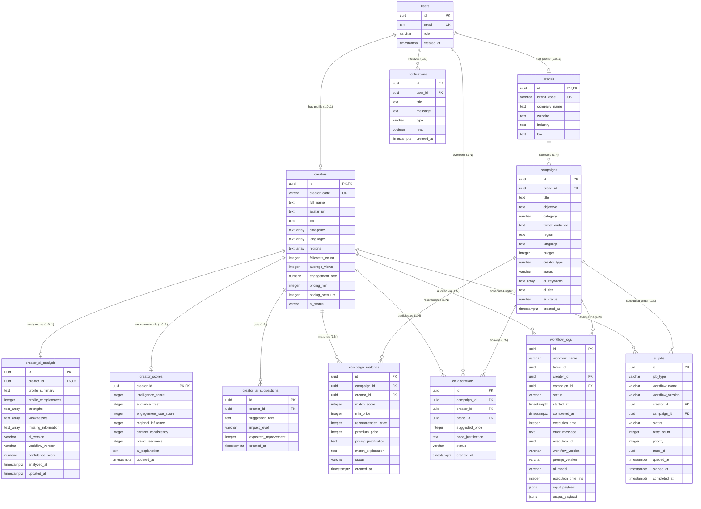

# CreatorLens - Integration Contract & Architecture Specs

This document defines the relational database architecture, mapping flows, and environment configurations for the CreatorLens platform.

---

## 1. Database ER Diagram

The following Mermaid entity relationship diagram represents the final production database schema deployed in Supabase, incorporating orchestration and auditing tables.



---

## 2. Screen ➔ API ➔ Database ➔ n8n Mapping

| Screen / Feature | API Endpoint | Database Table(s) | n8n Workflow Trigger |
| :--- | :--- | :--- | :--- |
| **Creator Registration** | `POST /api/auth/register` | `users` | N/A (Onboarding check) |
| **Creator Profile Onboarding** | `POST /api/creators/profile` | `creators` | N/A |
| **Creator AI Enrichment** | `POST /api/creators/enrich` | `ai_jobs` + `workflow_logs` | `creator_profile_enrichment` (WF-01, WF-02, WF-03) |
| **Creator Dashboard** | `GET /api/creators/profile/:id` | `creators` + `creator_ai_analysis` + `creator_scores` | N/A (Fetches merged AI telemetry) |
| **Growth suggestions** | `GET /api/creators/dashboard/:id` | `creator_ai_suggestions` | N/A (Created by WF-03 during enrichment) |
| **Brand Registration** | `POST /api/auth/register` | `users` | N/A |
| **Campaign Brief Setup** | `POST /api/campaigns` | `campaigns` | N/A |
| **Sourcing Match Trigger** | `POST /api/campaigns/:id/match` | `ai_jobs` + `workflow_logs` | `campaign_matching` (WF-04, WF-05, WF-06) |
| **Campaign Matches Grid** | `GET /api/campaigns/:id/matches` | `campaign_matches` + `creators` | N/A (Calculated matches by WF-05/06) |
| **Negotiation Request** | `POST /api/collaborations` | `collaborations` | N/A (Updates status & records) |
| **Admin Analytics Panel** | `GET /api/admin/logs` | `workflow_logs` + `ai_jobs` | N/A (Monitoring dashboard) |

---

## 3. Environment Configuration Spec

| Variable Key | Scope | Short Description / Purpose |
| :--- | :---: | :--- |
| **`PORT`** | Backend | Express server port listener (Defaults to `5000` in dev). |
| **`SUPABASE_URL`** | Both | The API endpoint URL of your Supabase project. |
| **`SUPABASE_SERVICE_ROLE_KEY`** | Backend | Secret key used to bypass RLS policies for administrative operations. |
| **`N8N_WEBHOOK_PROFILE`** | Backend | Webhook target URL for triggering profile enrichment. |
| **`N8N_WEBHOOK_CAMPAIGN`** | Backend | Webhook target URL for triggering campaign match sourcing. |
| **`JWT_SECRET`** | Backend | Salt value used to sign user authentication cookies and headers. |
| **`GEMINI_API_KEY`** | n8n | Google Gemini API key configured inside n8n credential manager. |
| **`STORAGE_BUCKET`** | Supabase | Storage bucket identifier used for hosting profile media files. |
| **`FRONTEND_URL`** | Backend | CORS origin configuration allowed to interact with the backend API. |
| **`BACKEND_URL`** | Frontend | Server REST gateway endpoint. |

---

## 4. Integration Flow Diagram

```
[FRONTEND DASHBOARD] (Initiates Action)
        │
        ▼ (POST /api/creators/enrich)
[EXPRESS BACKEND] (Orchestrator)
        │
        ├─────────► Writes job ('Queued/Processing') to [ai_jobs]
        ├─────────► Writes start trace to [workflow_logs]
        │
        ▼ (Webhook Trigger Payload with job_id)
[n8n WORKFLOW ENGINE]
        │
        ├─────────► Fetch Target Row from [Supabase Tables]
        ├─────────► Dispatch Context Prompt to [Google Gemini API]
        ├─────────► Parse & format Structured AI Insights
        │
        ▼ (Supabase Service Role Nodes)
[SUPABASE DATABASE]
        │
        ├─────────► Writes results to [creator_ai_analysis] / [creator_scores]
        ├─────────► Updates job status to 'Completed' in [ai_jobs]
        ├─────────► Updates logs with execution times in [workflow_logs]
        │
        ▼ (Polling Status Check: Completed!)
[FRONTEND DASHBOARD] (Refreshes & Renders Merged Data)
```
