# CreatorLens - Visual User Flow & Screen Map

This document presents the detailed end-to-end user navigation flow and screen connection map for the CreatorLens MVP.

---

## 1. User Journey Flow Map

```mermaid
flowchart TD
    %% Pre-Login
    LandingPage[Screen 01: Landing Page] -->|Click Sign In / Start| AuthSelector[Screen 05: Unified Login / Register]
    AuthSelector -->|Forgot Password| RecoveryOTP[Screen 06: Recover Password / OTP]
    AuthSelector -->|Register as Creator| CreatorWizard[Screen 03: Creator Onboarding Wizard]
    AuthSelector -->|Register as Brand| BrandWizard[Screen 04: Brand Onboarding Form]

    %% Creator Path
    CreatorWizard -->|Trigger Enrichment| CreatorDashboard[Screen 07: Creator Dashboard]
    CreatorDashboard -->|Sidebar Navigation| CreatorProfile[Screen 08: Profile Editor]
    CreatorDashboard -->|Sidebar Navigation| CreatorAIInsights[Screen 11: AI Insights Panel]
    CreatorDashboard -->|Sidebar Navigation| CreatorScores[Screen 12: Creator Score Breakdown]
    CreatorDashboard -->|Sidebar Navigation| CreatorSuggestions[Screen 13: Growth Suggestions Center]
    CreatorDashboard -->|Sidebar Navigation| CreatorCollabs[Screen 14: Collaboration Requests Feed]
    CreatorCollabs -->|Action: Open Proposal| NegotiationModal[Screen 15: Negotiation Detail Modal]
    CreatorDashboard -->|Sidebar Navigation| CreatorSettings[Screen 16: Settings & Security]

    %% Brand Path
    BrandWizard -->|Submit Details| BrandDashboard[Screen 17: Brand Dashboard]
    BrandDashboard -->|Sidebar Navigation| CampaignWizard[Screen 18: Campaign Creator Brief]
    CampaignWizard -->|Save & Parse| CampaignAnalyzer[Screen 19: AI Campaign Brief Analyzer]
    BrandDashboard -->|Sidebar Navigation| CreatorDiscovery[Screen 20: Creator Discovery Grid]
    CreatorDiscovery -->|Click: View Profile| MatchDetails[Screen 22: Campaign Match Details]
    MatchDetails -->|Click: Valuation| PricingModal[Screen 23: Pricing Recommendation Modal]
    MatchDetails -->|Click: Express Interest| NegotiationHub[Screen 25: Negotiation Hub Offers]
    BrandDashboard -->|Sidebar Navigation| BrandSettings[Screen 26: Connected Accounts Manager]

    %% Admin Path
    AuthSelector -->|Admin Credentials| AdminDashboard[Screen 27: Admin Dashboard]
    AdminDashboard -->|Tab: Users| UserRegistry[Screen 28: User Management List]
    AdminDashboard -->|Tab: Campaigns| CampAudit[Screen 29: Campaign Audit View]
    AdminDashboard -->|Tab: n8n Logs| JobsMonitor[Screen 30: AI Jobs Orchestrator]
    JobsMonitor -->|Click: Log Row| SystemLogs[Screen 31: System Telemetry Logs]
    AdminDashboard -->|Sidebar Navigation| PlatformSettings[Screen 32: Platform Configuration]

    %% Styling
    classDef preLogin fill:#151f32,stroke:#00D4FF,stroke-width:2px,color:#fff;
    classDef creator fill:#151f32,stroke:#00F2A6,stroke-width:2px,color:#fff;
    classDef brand fill:#151f32,stroke:#4F46E5,stroke-width:2px,color:#fff;
    classDef admin fill:#151f32,stroke:#94A3B8,stroke-width:2px,color:#fff;

    class LandingPage,AuthSelector,RecoveryOTP preLogin;
    class CreatorWizard,CreatorDashboard,CreatorProfile,CreatorAIInsights,CreatorScores,CreatorSuggestions,CreatorCollabs,NegotiationModal,CreatorSettings creator;
    class BrandWizard,BrandDashboard,CampaignWizard,CampaignAnalyzer,CreatorDiscovery,MatchDetails,PricingModal,NegotiationHub,BrandSettings brand;
    class AdminDashboard,UserRegistry,CampAudit,JobsMonitor,SystemLogs,PlatformSettings admin;
```

---

## 2. Walkthrough Flow Breakdown

### A. Creator Portal Flow
* The user registers on `Screen 05` and enters details on `Screen 03`. 
* Once profile enrichment is triggered, the status is monitored via the progress modal.
* The dashboard (`Screen 07`) redirects the user to score breakdown metrics (`Screen 12`), AI suggestion points (`Screen 13`), or incoming sponsorship details (`Screen 14`).

### B. Brand Portal Flow
* The brand creates campaigns on `Screen 18`, immediately triggering the brief analyzer (`Screen 19`).
* Brands search creators on `Screen 20`, view match percentages on `Screen 22`, examine recommended price valuations on `Screen 23`, and negotiate contracts on `Screen 25`.
